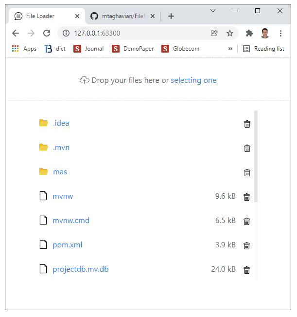

## What is this
This is a simple demonstration of uploading and downloading files via web (HTML, CSS and Javascript, here we use UIKit as the CSS theme and uploader element), and using Spring as the server.
We store the files in the database (here we simply use H2), using records of LOBs (Large Object), each having a limited volume of file's data. The first record is the master record containing the IDs of the data records.
  
## How to use
1. Build application with "mvn package -DskipTests"
2. Run application with "java -jar target\fileloader-0.0.1-SNAPSHOT.jar"
3. Connect to the server using chrome or firefox (Open http://localhost:63300/, make sure to enter the server's IP address instead of localhost in the link).
4. Drag and drop files to upload and click on the files to download (by clicking on the folders, the corresponding zip file will be downloaded).

## About
Masoud Taghavian (masoud.taghavian@gmail.com)  
Enjoy!

## Screenshots

